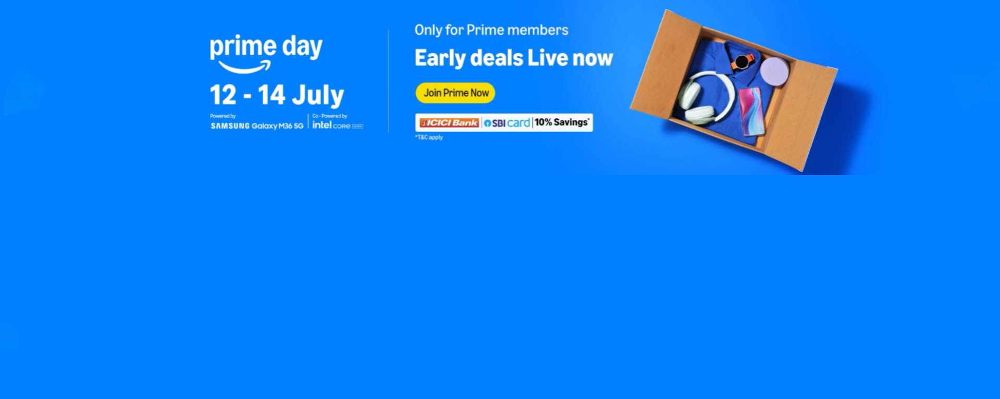

# Amazon Clone (Frontend)

This project is a static Amazon homepage clone built using HTML and CSS. It recreates the core layout of the Amazon landing page, including the top navigation, search bar, hero banner, and product category cards.

## Project Goals

- Practice building responsive page layouts.
- Improve CSS positioning, spacing, and alignment skills.
- Recreate a real-world ecommerce homepage UI.

## Features

- Amazon-style top header and secondary navigation bar.
- Search input area with category selector.
- Hero banner section with promotional styling.
- Multi-card product grid layout.
- Reusable image asset folder for UI content.

## Tech Stack

- HTML5
- CSS3

## Project Structure

```
Amazon Project/
|-- index.html
|-- StyleAmazon.css
|-- README.md
`-- photos/
```

## Screenshots

### Screenshot 1


Direct link: [View image](https://drive.google.com/file/d/1weWavS6cQwMsweO88wWx6oVWDVmRHdDF/view?usp=drive_link)

### Screenshot 2


Direct link: [View image](https://drive.google.com/file/d/1WxpYtAW-X1oe0O-n8h53J7HjkMp5GuUW/view?usp=drive_link)

### Local Asset Preview



## Getting Started

1. Clone or download this project.
2. Open the project folder in VS Code.
3. Open index.html in your browser.

Optional:
- Use the Live Server extension in VS Code for a smoother development preview.

## Customization

- Edit text and structure in index.html.
- Adjust colors, spacing, and layout styles in StyleAmazon.css.
- Replace assets in photos/ to update banners and product cards.

## Notes

- This is a frontend practice project and is not connected to real backend services.
- Product links, cart actions, and authentication are UI-only in this version.
